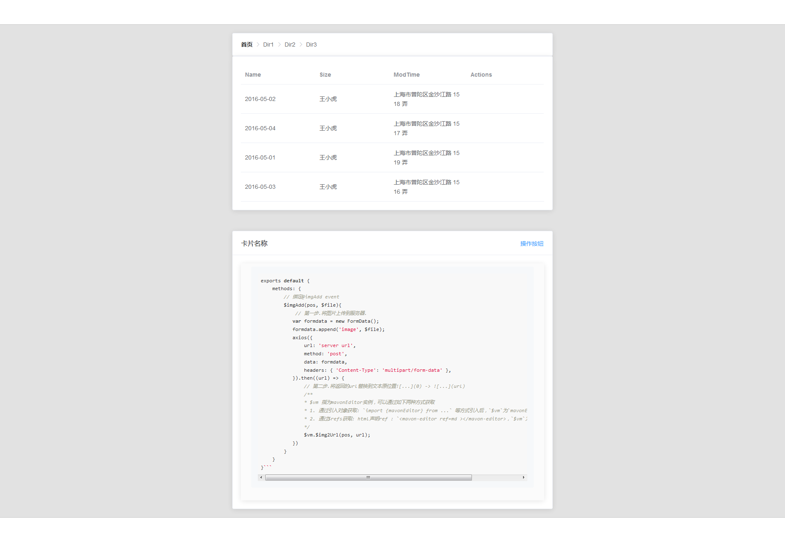

# vue-filestore
Develop a file store application. This repo just is front-end pages. vue*+elementUI

## Want
1. Show Dictionary
2. Show README.md content in Main Page
3. Download and upload
4. "操作按钮" should have "raw string" "download"...
4. For files,"*.md" show render style, "*.other" show highlight
4. and so on...

## show - timeline

* 2019.11.14
    
